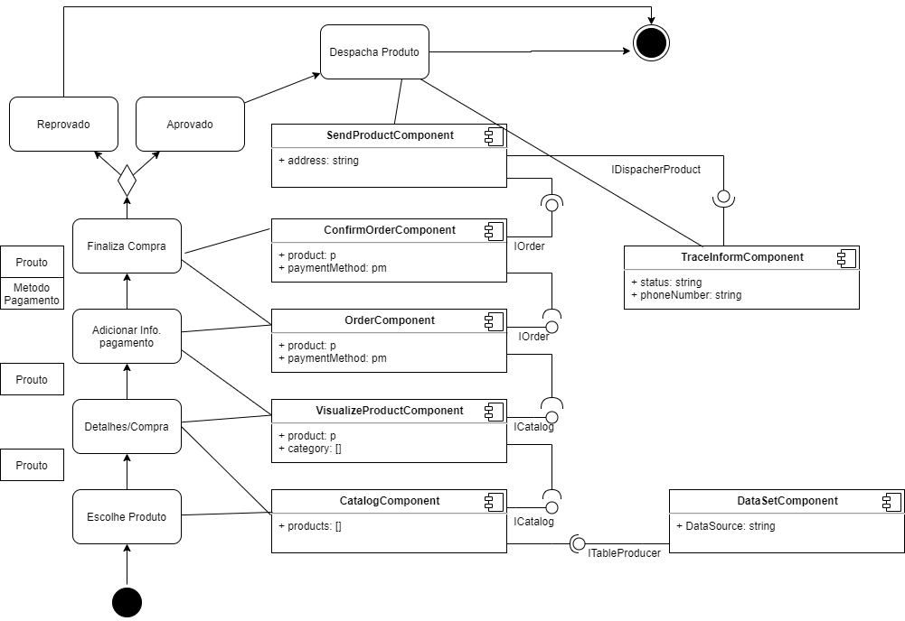
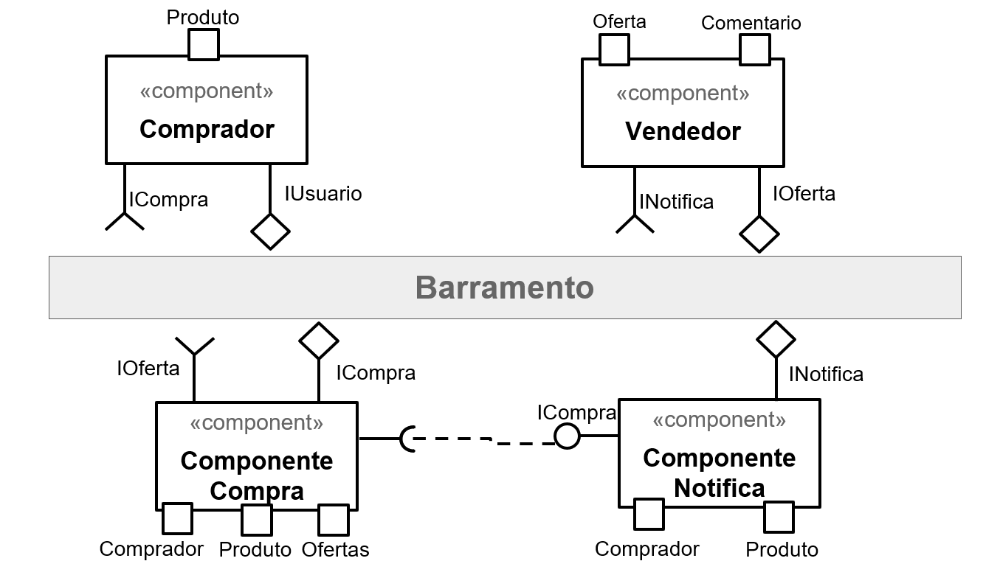
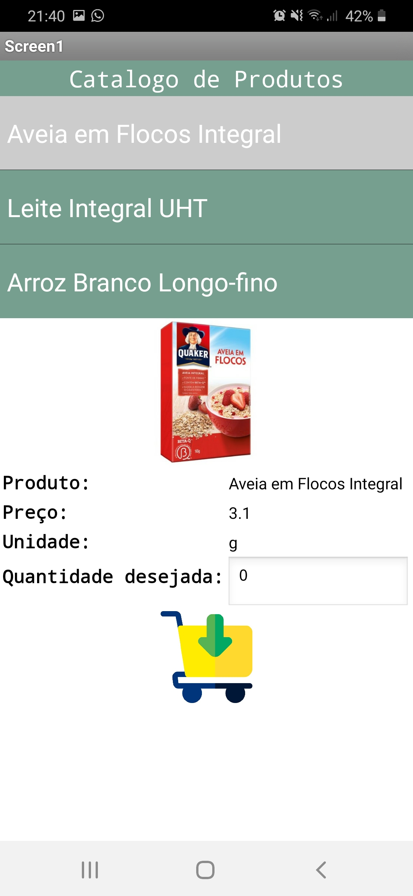
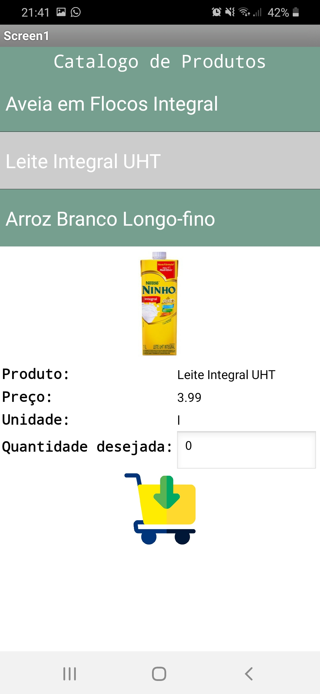
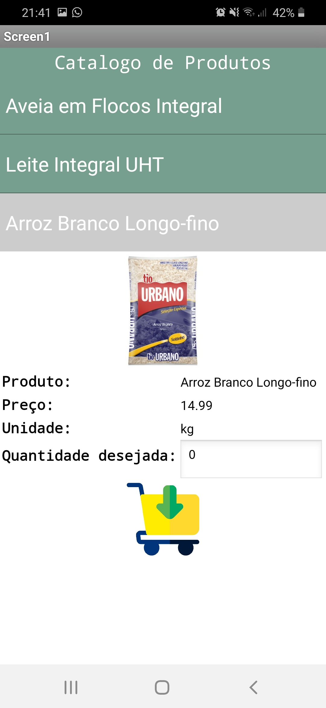
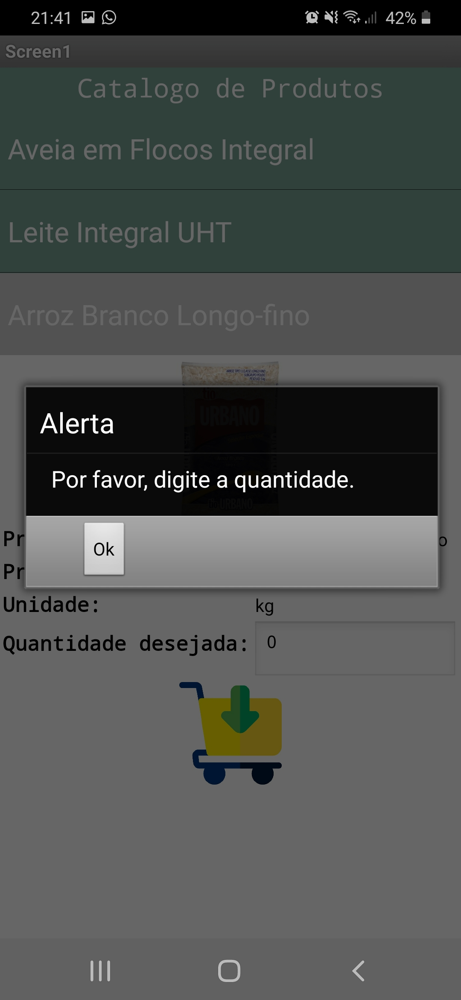
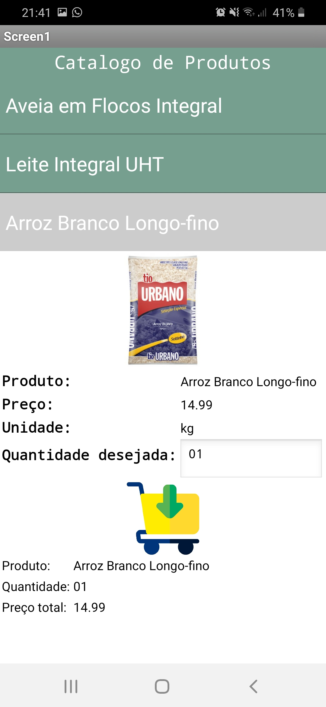
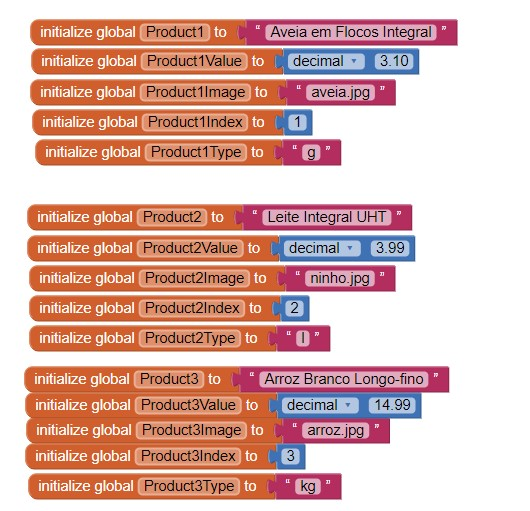
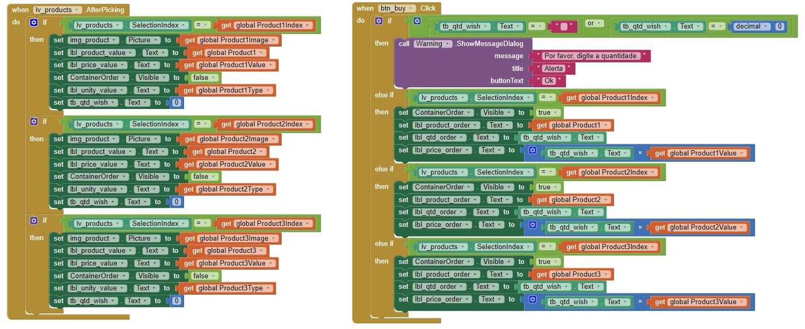

## Lab03 - Model-View-Controller

### ALUNO
   >Mateus Gonçalves Geracino
  

### Tarefa 1
  
 

### Tarefa 2
  
 

### Tarefa 3
#### Inicial

#### Produto - Aveia

#### Produto - Ninho

#### Produto - Arroz

#### Produto - Validação de quantidade

#### Produto - Efetivação

 
 
#### Produto - Diagramas
 
 
 

### Tarefa 4
 
