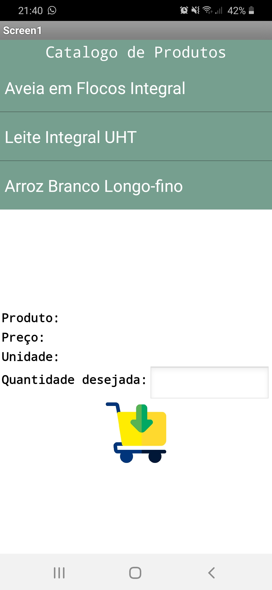

## Lab03 - Model-View-Controller

### ALUNO
   >Mateus Gonçalves Geracino
  

### Tarefa 1
  
 

### Tarefa 2
  
 

### Tarefa 3
#### Inicial
 
#### Produto - Aveia
 
#### Produto - Ninho
 
#### Produto - Arroz
 
#### Produto - Validação de quantidade
 
#### Produto - Efetivação
 
 
 
#### Produto - Diagramas
 
 
 

### Tarefa 4
 
