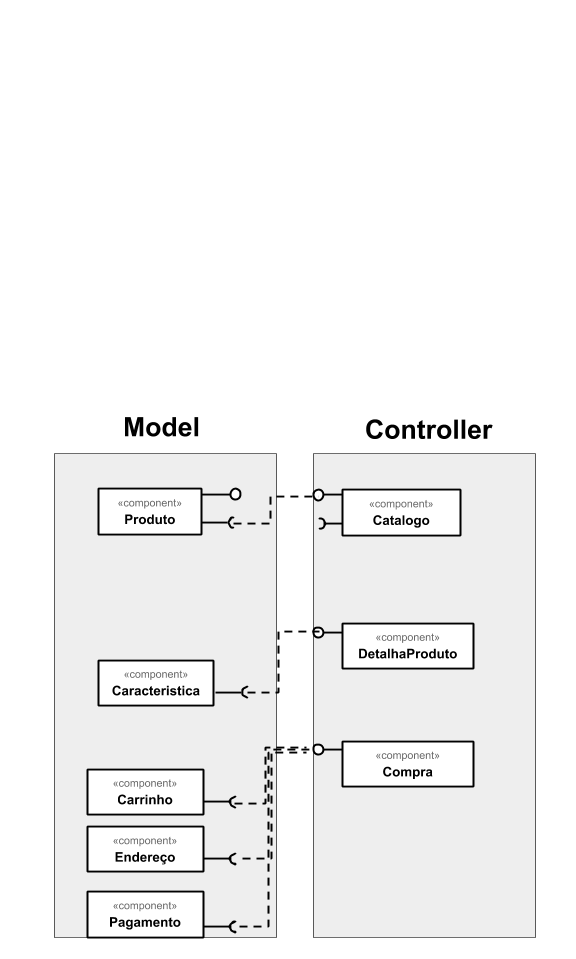

## Lab04 - Serviços

### ALUNO
   >Mateus Gonçalves Geracino
  

## Tarefa 1 - Componentes de Negócio

 
## Tarefa 2 - Componentes Técnicos

 
## Tarefa 3 - Componentes Técnicos

 
## Tarefa 4 - Usando APIs

### Serviço: College Football Data
* **Título do serviço:** Get Games
* **Breve descrição:** Acessando todos os tipos de dados de futebol universitário
* **URL completa da requisição:** https://api.collegefootballdata.com/games?year=2020&week=2&seasonType=regular&team=Cincinnati
* **Cabeçalho HTTP da chamada:**
~~~http
:authority: any-api.com:8443
:method: GET
:path: /https://api.collegefootballdata.com/games?year=2020&week=2&seasonType=regular&team=Cincinnati
:scheme: https
accept: */*
accept-encoding: gzip, deflate, br
accept-language: pt-BR,pt;q=0.9,en-US;q=0.8,en;q=0.7
if-none-match: W/"227-J/jekQXC/Sl5wAXBTvV6uPsAlj8"
origin: https://any-api.com
referer: https://any-api.com/collegefootballdata_com/collegefootballdata_com/console/games/getGames
sec-fetch-dest: empty
sec-fetch-mode: cors
sec-fetch-site: same-site
user-agent: Mozilla/5.0 (Windows NT 10.0; Win64; x64) AppleWebKit/537.36 (KHTML, like Gecko) Chrome/84.0.4147.135 Safari/537.36
~~~
* **Cabeçalho HTTP da resposta:**
~~~http
access-control-allow-origin: *
content-type: application/json; charset=utf-8
date: Sat, 29 Aug 2020 02:26:53 GMT
etag: W/"227-J/jekQXC/Sl5wAXBTvV6uPsAlj8"
server: cloudflare
strict-transport-security: max-age=15552000; includeSubDomains
x-content-type-options: nosniff
x-dns-prefetch-control: off
x-download-options: noopen
x-final-url: https://api.collegefootballdata.com/games?year=2020&week=2&seasonType=regular&team=Cincinnati
x-frame-options: SAMEORIGIN
x-xss-protection: 1; mode=block
~~~
* **Conteúdo da resposta:**
~~~json
[
  {
    "id": 401212542,
    "season": 2020,
    "week": 2,
    "season_type": "regular",
    "start_date": "2020-09-11T04:00:00.000Z",
    "start_time_tbd": true,
    "neutral_site": false,
    "conference_game": false,
    "attendance": null,
    "venue_id": 3854,
    "venue": "Nippert Stadium",
    "home_id": 2132,
    "home_team": "Cincinnati",
    "home_conference": "American Athletic",
    "home_points": null,
    "home_line_scores": null,
    "home_post_win_prob": null,
    "away_id": 2711,
    "away_team": "Western Michigan",
    "away_conference": "Mid-American",
    "away_points": null,
    "away_line_scores": null,
    "away_post_win_prob": null,
    "excitement_index": null
  }
]
~~~

### Serviço: ODWeather
* **Título do serviço:** Get data from the easywind weather stations
* **Breve descrição:** Obtenha dados das estações meteorológicas
* **URL completa da requisição:** http://api.oceandrivers.com/v1.0/getAemetStation/aeropuertopalma/lastdata/
* **Cabeçalho HTTP da chamada:**
~~~http
:authority: any-api.com:8443
:method: GET
:path: /http://api.oceandrivers.com/v1.0/getAemetStation/aeropuertopalma/lastdata/
:scheme: https
accept: application/json
accept-encoding: gzip, deflate, br
accept-language: pt-BR,pt;q=0.9,en-US;q=0.8,en;q=0.7
origin: https://any-api.com
referer: https://any-api.com/oceandrivers_com/oceandrivers_com/console/ODWeather/getAemetStation
sec-fetch-dest: empty
sec-fetch-mode: cors
sec-fetch-site: same-site
user-agent: Mozilla/5.0 (Windows NT 10.0; Win64; x64) AppleWebKit/537.36 (KHTML, like Gecko) Chrome/84.0.4147.135 Safari/537.36
~~~
* **Cabeçalho HTTP da resposta:**
~~~http
access-control-allow-headers: x-requested-with, Content-Type, origin, authorization, accept, client-security-token
access-control-allow-methods: POST, GET, OPTIONS, DELETE, PUT
access-control-allow-origin: *
access-control-max-age: 1000
content-type: application/json
date: Sat, 29 Aug 2020 02:15:48 GMT
server: cloudflare
x-final-url: https://api.oceandrivers.com/v1.0/getAemetStation/aeropuertopalma/lastdata/
~~~
* **Conteúdo da resposta:**
~~~json
{
  "TEMPERATURE": 23.2,
  "TWD": 360,
  "PRESSURE": 1002.2,
  "RAIN_MONTH": 0,
  "TWS_GUST": 2.5,
  "RAIN_DAY": 0,
  "RAIN": 0,
  "HUMIDITY": 87,
  "TWS": 0.8333333333333333,
  "TIME_STRING": "29/08/2020 03:00",
  "TWD_GUST": 90,
  "TIME": 1598666400000,
  "LATITUDE": 39.5604,
  "LONGITUDE": 2.7417,
  "LOCALTIME": 1
}
~~~
