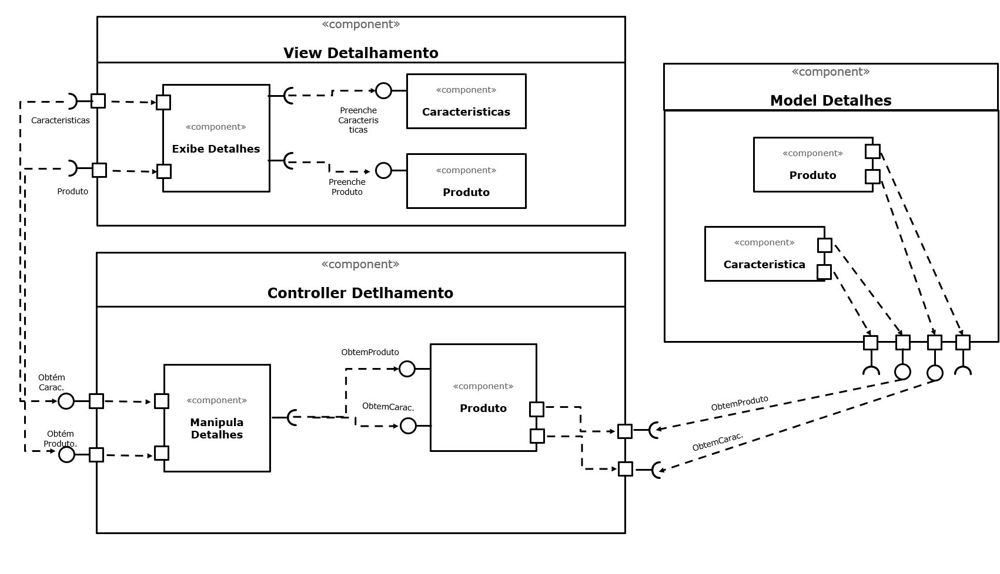

## Lab05 - Web

### ALUNO
   >Mateus Gonçalves Geracino
  

## Tarefa 1

## Tarefa 2
Link codepen: [React 03 - Componente Barra](https://codepen.io/mateusggeracino/pen/ZEWaMBK)

**HTML**
~~~html

  

  

  

~~~

**JavaScript**
~~~javascript
class Barra extends React.Component {
  render() {
    let resultado = "";
    for (let b = 1; b <= this.props.tamanho; b++)
      resultado += "=";
    return resultado;
  }
}

const elemento = 

                   <h2>O dinossauro</h2>
                   <Barra tamanho="10"/>
                   <h2>pulou na lama.</h2>
                 

ReactDOM.render(elemento, 
        document.getElementById("root"));

const dinossaur = 

                   </img>
                   
                  

      
ReactDOM.render(dinossaur, document.getElementById("container-dinossaur"))
      
var moveDiv = document.getElementById('comet');
window.onmousemove = function (e) {
    var x = e.pageX,
        y = e.pageY;
    moveDiv.style.top = (y + (-80)) + 'px';
    moveDiv.style.left = (x + 10) + 'px';
};

var i = 0;
var ref = setInterval(() => {  
  ReactDOM.render(
Correndo: {i} km
, document.getElementById('text'));
  i++;
  if (i == 9999) clearInterval(ref);
}, 400);
~~~
